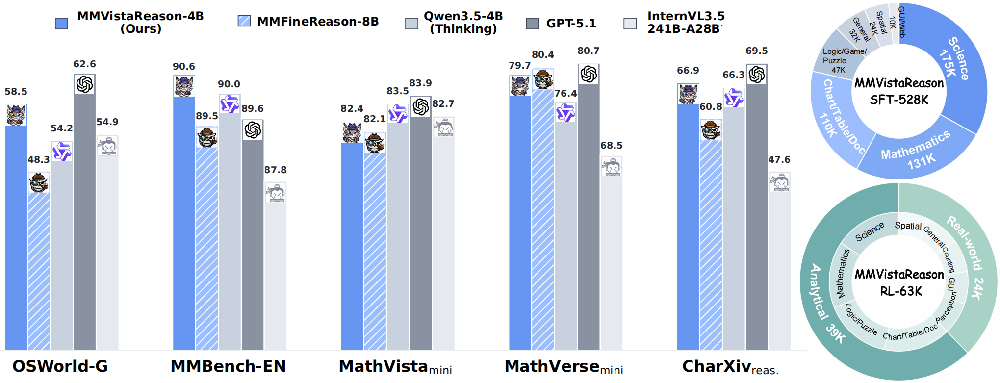
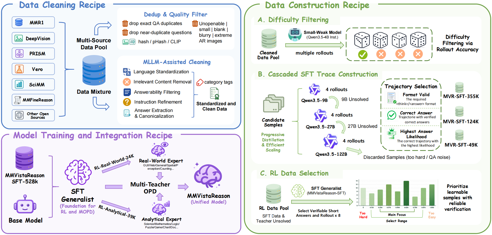
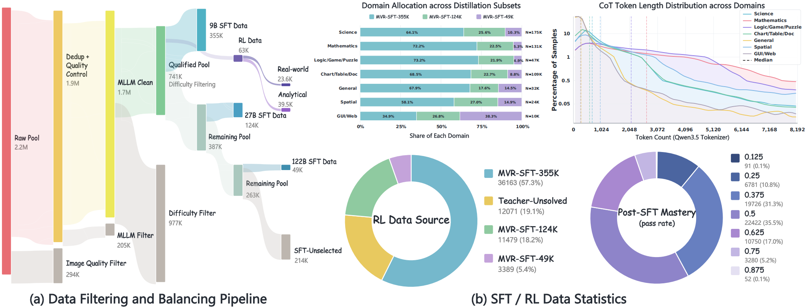

# MMVistaReason: Toward Open-Data and Post-Training Recipes for Multimodal Reasoning

MMVistaReason (MVR) is an open-data and post-training recipe for building reliable multimodal reasoning models. It organizes the workflow into three components:

1. **Data Cleaning Recipe** for curating heterogeneous open multimodal data.
2. **Data Construction Recipe** for difficulty-aware SFT trajectory construction and scale-specific RL frontier-data selection.
3. **Model Training and Integration Recipe** for SFT, complementary RL expert specialization, and multi-teacher on-policy distillation (MOPD).

The recipes produce a 528K supervised fine-tuning corpus and a 63K reinforcement-learning corpus covering both real-world and analytical visual reasoning at the 4B and 9B model scales.

<p align="center">
  <a href="https://github.com/JackieForest/MMVistaReason">Code</a> |
  <a href="https://huggingface.co/collections/JackieLin0123/mmvistareason">Hugging Face Collection</a> |
</p>

## Highlights

- **Open multimodal data recipe.** Staged deduplication, visual-quality filtering, MLLM-assisted cleaning, answer normalization, and structured annotation.
- **Difficulty-aware supervision.** A small model first removes trivial samples, while progressively stronger same-family teachers solve the remaining samples.
- **Answer-Likelihood Best-of-N.** Correct, format-valid trajectories are ranked by normalized final-answer likelihood instead of trajectory length alone.
- **Scale-specific frontier RL data.** RL prompts are selected according to the post-SFT rollout pass rates of each model scale, focusing training on learnable but not-yet-mastered samples.
- **Adaptive model integration.** Real-world and analytical RL experts are consolidated into one model through multi-teacher on-policy distillation.

## Overview



Across 15 multimodal benchmarks, MMVistaReason-4B scores **72.8**, outperforming Qwen3.5-9B (Instruct) and MMFineReason-8B with about 70% fewer SFT samples than MMFineReason. MMVistaReason-9B reaches **74.4**, surpassing Qwen3.5-35B-A3B (Instruct).

## Recipe Framework



### 1. Data Cleaning Recipe

The cleaning pipeline aggregates open multimodal VQA-style data and standardizes it through:

- exact and near-duplicate removal using image hashes, perceptual hashes, and semantic similarity;
- corrupted, blank, blurry, low-resolution, and extreme-aspect-ratio image filtering;
- language standardization and irrelevant-content removal;
- answerability filtering and instruction refinement;
- answer extraction and canonicalization;
- domain, task-type, and source-metadata annotation.

The corresponding prompts, configuration, and rollout scripts are under [`data_cleaning`](data_cleaning).

### 2. Data Construction Recipe

#### Difficulty filtering

Qwen3.5-4B-Instruct generates four responses per cleaned sample. Samples solved in any rollout are considered too easy for the subsequent distillation cascade; samples that fail all four rollouts are retained.

#### Cascaded SFT trajectory construction

Retained samples pass through Qwen3.5-9B, Qwen3.5-27B, and Qwen3.5-122B-A10B in sequence. Each sample is assigned to the first teacher that solves it:

| SFT subset             | Teacher           |     Samples |
| ---------------------- | ----------------- | ----------: |
| MVR-SFT-355K           | Qwen3.5-9B        |     354,886 |
| MVR-SFT-124K           | Qwen3.5-27B       |     124,010 |
| MVR-SFT-49K            | Qwen3.5-122B-A10B |      48,913 |
| **MVR-SFT-528K**       | All teachers      | **527,809** |

All selected trajectories must have a verified correct answer and valid `<think>...</think>` / `<answer>...</answer>` structure. When several candidates remain, Answer-Likelihood Best-of-N selects the trajectory with the highest length-normalized final-answer likelihood.

#### Scale-specific RL frontier-data selection

At each model scale, the corresponding SFT generalist generates eight rollouts per candidate. Fully failed and fully solved samples are removed, and middle-pass-rate data are balanced into two groups:

| Model scale | RL subset  | Primary coverage                                                 |    Samples |
| ----------- | ---------- | ---------------------------------------------------------------- | ---------: |
| 4B          | Analytical | Science, mathematics, logic/puzzle, chart/document               |     19,125 |
| 4B          | Real-World | General vision, spatial reasoning, GUI/web, perception, counting |     11,597 |
| 9B          | Analytical | Science, mathematics, logic/puzzle, chart/document               |     20,400 |
| 9B          | Real-World | General vision, spatial reasoning, GUI/web, perception, counting |     11,980 |
|             | **MVR-RL-63K** | Both groups at both scales                                   | **63,102** |

### 3. Model Training and Integration Recipe

1. **Full-data SFT:** train unified 4B and 9B generalists on MVR-SFT-528K.
2. **RL expert specialization:** initialize two experts at each scale from the corresponding SFT model and optimize them on the Real-World and Analytical subsets with GSPO.
3. **MOPD integration:** initialize the student from the SFT generalist and route every sample to its corresponding expert. The teacher provides top-K token-level supervision on prefixes generated by the student itself.

## Data Analysis



The SFT subsets provide complementary difficulty and domain coverage. Smaller students benefit more from broad supervision, whereas the 9B student matches full-data performance with the 124K subset. Scale-specific RL focuses on medium-mastery examples. MOPD integrates the complementary experts more consistently than mixed-domain RL, with forward-KL preferred at 4B and reverse-KL at 9B.

## Citation

If you find this project useful, please cite:

```bibtex
@article{lin2026mmvistareason,
  title   = {MMVistaReason: Toward Open-Data and Post-Training Recipes for Multimodal Reasoning},
  author  = {Lin, Juekai and Lin, Honglin and Yuan, Yuqian and Wu, Xiaolong and Cao, Jie and Liang, Liang and Cao, Yunqi and Zhu, Yun and Zhang, Wenqiao and Wu, Lijun},
  year    = {2026}
}
```

## Acknowledgements

MMVistaReason builds on open multimodal datasets and the open-source ecosystems around Qwen, vLLM, LLaMA-Factory, VeRL, VLMEvalKit, and the broader multimodal reasoning community.
